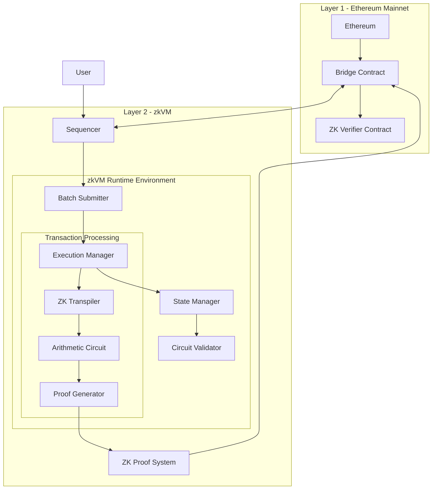

# ZK-VM-Architecture
A Zero-Knowledge Virtual Machine (zkVM) architecture designed for Layer 2 scaling solutions, enabling privacy-preserving computation with zero-knowledge proofs

## Architecture Diagram

