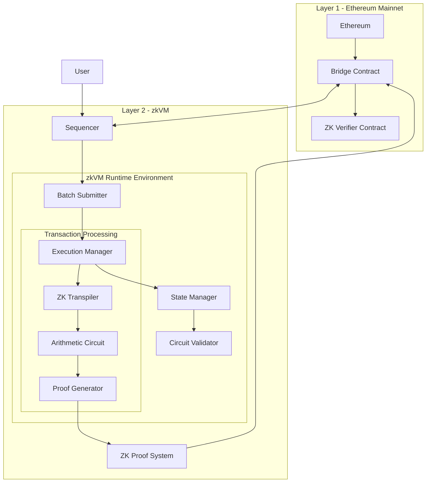
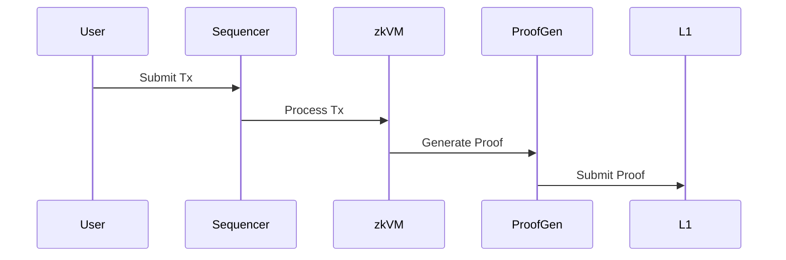
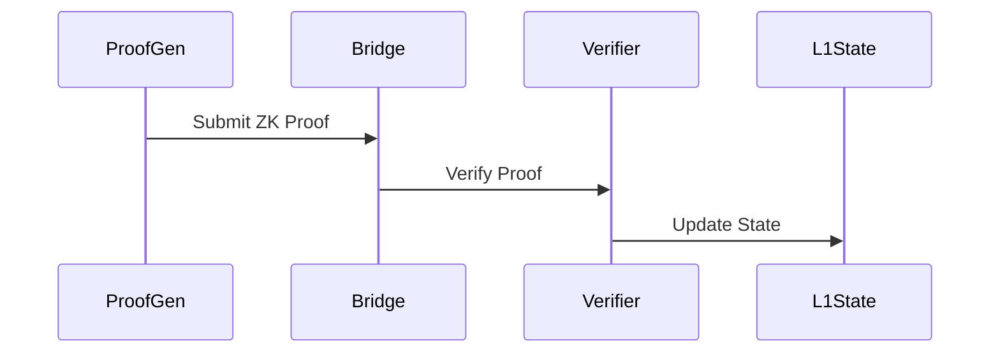

# zkVM-Architecture
A Zero-Knowledge Virtual Machine (zkVM) architecture designed for Layer 2 scaling solutions, enabling privacy-preserving computation with zero-knowledge proofs


## Architecture Diagram


## Core Components
- zkVM Runtime Environment
  ```solidity
  interface IZKVMRuntime {
    struct ExecutionContext {
        uint256 blockNumber;
        uint256 timestamp;
        bytes32 stateRoot;
        bytes32 zkProof;
    }
    
    function executeTransaction(
        bytes calldata txData,
        ExecutionContext calldata context
    ) external returns (bytes32 newStateRoot, bytes32 proof);
  }
  ```
- Circuit Components
  ```solidity
    // Arithmetic Circuit Definition
    struct ArithmeticCircuit {
        // R1CS constraints
        constraints: Vec<Constraint>,
        // Witness variables
        witness: Vec<Fr>,
        // Public inputs
        public_inputs: Vec<Fr>,
    }
    
    // Proof Generator
    struct ProofGenerator {
        // Setup parameters
        proving_key: ProvingKey,
        // Verification key
        verification_key: VerificationKey,
    }
  ```
- State Management
  ```solidity
    interface IStateManager {
        // Commit state update with ZK proof
        function commitStateUpdate(
            bytes32 oldStateRoot,
            bytes32 newStateRoot,
            bytes calldata zkProof
        ) external returns (bool);
    }
  ```

## Communication Flow
### Transaction Processing


### Proof Verification


### Security Features
- Zero-Knowledge Proof System
  ```solidity
  interface ZKProofSystem {
    // Generate proof
    function generateProof(
        Circuit circuit,
        Witness witness
    ): Promise<Proof>;
    
    // Verify proof
    function verifyProof(
        Proof proof,
        VerificationKey vk
    ): Promise<boolean>;
  }
  ```
- Circuit Validation
  ```rust
  impl CircuitValidator {
    // Validate circuit constraints
    fn validate_constraints(&self) -> Result<(), Error>;
    
    // Check witness satisfaction
    fn check_witness(&self, witness: &Witness) -> bool;
  }
  ```

### Performance Optimizations
- Recursive Proofs
  ```solidity
  interface RecursiveProver {
    // Aggregate multiple proofs
    function aggregateProofs(
        Proof[] proofs
    ): Promise<Proof>;
    
    // Verify recursive proof
    function verifyRecursiveProof(
        Proof aggregateProof
    ): Promise<boolean>;
  }
  ```
- Batch Processing
  ```solidity
  contract BatchProcessor {
    // Process multiple transactions in single proof
    function processBatch(
        Transaction[] calldata txs,
        bytes32 oldStateRoot
    ) external returns (
        bytes32 newStateRoot,
        bytes32 zkProof
    );
  }
  ```


